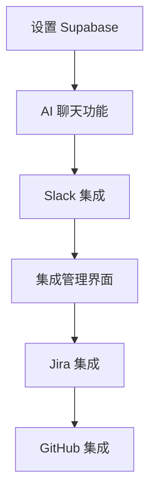

# 🎯 AI Brain - 下一步任务清单

## 📋 立即可执行的任务 (按优先级排序)

### 🚀 阶段 1: 核心功能构建 (建议先执行)

#### 1. 数据库设置 ⭐⭐⭐
```bash
# 任务估时: 2-3 小时
```
- [ ] 配置 Supabase 项目和数据库
- [ ] 创建核心数据表 (users, conversations, messages, integrations)
- [ ] 设置 Row Level Security (RLS) 策略
- [ ] 生成 TypeScript 类型定义

#### 2. AI 聊天功能 ⭐⭐⭐
```bash
# 任务估时: 1-2 天
```
- [ ] 创建聊天界面组件 (`/app/(dashboard)/chat/page.tsx`)
- [ ] 集成 OpenAI GPT-4 API (`/app/api/ai/chat/route.ts`)
- [ ] 实现实时消息流 (Server-Sent Events 或 WebSocket)
- [ ] 添加消息历史存储和检索

#### 3. 第一个工具集成 - Slack ⭐⭐⭐
```bash
# 任务估时: 2-3 天
```
- [ ] Slack OAuth 认证流程
- [ ] 基础消息发送/接收 API
- [ ] 频道列表获取
- [ ] Slack 消息同步到聊天界面

### 🔧 阶段 2: 增强功能

#### 4. 集成管理界面 ⭐⭐
```bash
# 任务估时: 1-2 天
```
- [ ] 创建集成列表页面 (`/app/(dashboard)/integrations/page.tsx`)
- [ ] OAuth 连接状态显示
- [ ] 集成配置界面
- [ ] 连接/断开连接功能

#### 5. 基础工作流自动化 ⭐⭐
```bash
# 任务估时: 2-3 天
```
- [ ] AI 函数调用系统
- [ ] 简单的自动化规则 (如：创建 Jira 票据)
- [ ] 工具执行结果显示
- [ ] 错误处理和重试机制

### 🎨 阶段 3: 用户体验优化

#### 6. 仪表板完善 ⭐
```bash
# 任务估时: 1 天
```
- [ ] 添加使用统计小部件
- [ ] 最近活动展示
- [ ] 快速操作按钮
- [ ] 响应式布局优化

## 🛠 技术实现建议

### 立即开始的最小可行产品 (MVP)：

1. **今天就能开始**：配置 Supabase 数据库
2. **本周完成**：基础聊天功能 + OpenAI 集成
3. **下周目标**：Slack 集成 + 集成管理界面

### 推荐的开发顺序：



## 📁 具体文件创建计划

### 第一周需要创建的文件：
```
app/
├── (dashboard)/
│   ├── chat/
│   │   ├── page.tsx              # 聊天主界面
│   │   └── components/
│   │       ├── chat-interface.tsx
│   │       ├── message-list.tsx
│   │       └── message-input.tsx
│   └── integrations/
│       └── page.tsx              # 集成管理界面
├── api/
│   ├── ai/
│   │   └── chat/route.ts         # AI 聊天 API
│   └── integrations/
│       └── slack/route.ts        # Slack 集成 API
lib/
├── ai/
│   ├── openai.ts                 # OpenAI 配置
│   └── tools.ts                  # AI 工具定义
└── integrations/
    └── slack.ts                  # Slack SDK 配置
```

## 🎯 每日任务建议

### 第 1 天：数据库设置
- [ ] 创建 Supabase 项目
- [ ] 设计数据库架构
- [ ] 创建必要的表和关系
- [ ] 配置 RLS 策略

### 第 2-3 天：AI 聊天功能
- [ ] 创建聊天 UI 组件
- [ ] 集成 OpenAI API
- [ ] 实现消息存储
- [ ] 添加打字指示器

### 第 4-5 天：Slack 集成
- [ ] 设置 Slack OAuth
- [ ] 实现基础 Slack API 调用
- [ ] 创建消息同步功能
- [ ] 测试集成流程

### 第 6-7 天：集成管理
- [ ] 创建集成列表界面
- [ ] 实现连接状态显示
- [ ] 添加配置选项
- [ ] 优化用户体验

## 🚨 重要提示

### 开始之前必须完成：
1. ✅ **Supabase 项目创建** - 获取数据库 URL 和 API 密钥
2. ✅ **OpenAI API 密钥** - 获取 GPT-4 访问权限
3. ✅ **Slack 应用创建** - 设置 OAuth 和权限

### 环境变量检查清单：
```env
# 必需的环境变量
NEXT_PUBLIC_SUPABASE_URL=
NEXT_PUBLIC_SUPABASE_ANON_KEY=
SUPABASE_SERVICE_ROLE_KEY=
OPENAI_API_KEY=
SLACK_BOT_TOKEN=
SLACK_SIGNING_SECRET=
```

## 💡 开发小贴士

1. **逐步实现**：不要试图一次构建所有功能
2. **测试驱动**：每个功能完成后立即测试
3. **用户反馈**：尽早获取用户反馈
4. **性能监控**：及时发现和解决性能问题

## 🎉 快速启动命令

```bash
# 1. 克隆并启动项目
cd "/Users/leeqi/Desktop/AI Brain/ai-brain"
npm run dev

# 2. 设置环境变量
cp .env.local.example .env.local
# 编辑 .env.local 填入真实的 API 密钥

# 3. 开始第一个任务
# 建议先从数据库设置开始
```

---

**🚀 选择一个任务开始您的 AI Brain 开发之旅！建议从数据库设置开始。**